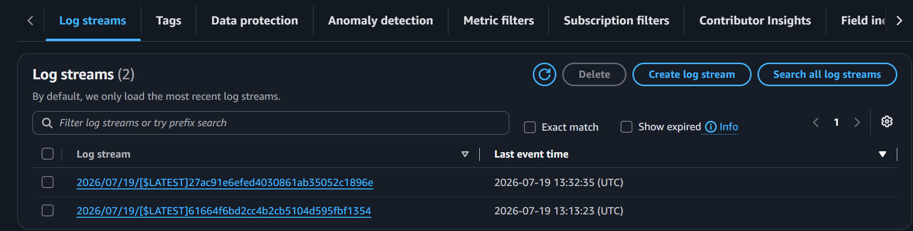
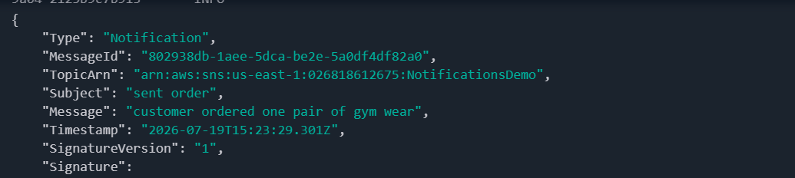

# AWS SNS → SQS → Lambda Event-Driven Order Processing System

## 📖 Project Overview

This project demonstrates an event-driven order processing system built using Amazon SNS, Amazon SQS, AWS Lambda, IAM, and Amazon CloudWatch.

When a customer places an order, Amazon SNS publishes a notification to a topic. The notification is delivered to an Amazon SQS queue through a subscription. AWS Lambda automatically polls the queue, retrieves the messages in batches, processes them, and writes the execution logs to Amazon CloudWatch.

This project demonstrates how multiple AWS services work together to build a reliable and loosely coupled event-driven architecture.

---

## ☁️ AWS Services Used

### Amazon SNS (Simple Notification Service)

Amazon SNS is a publish/subscribe messaging service that broadcasts copies of messages to multiple subscribers.

In this project, SNS was used to:

- Create a topic
- Publish order messages
- Connect the topic to an SQS queue using a subscription

---

### Amazon SQS (Simple Queue Service)

Amazon SQS is a message queue service that stores messages until another service is ready to process them.

In this project, SQS was used to:

- Receive messages from SNS
- Store messages safely
- Deliver messages to Lambda for processing

---

### AWS Lambda

AWS Lambda is a serverless compute service that automatically runs code in response to events.

In this project, Lambda was used to:

- Poll the SQS queue
- Process messages in batches
- Log processed messages to Amazon CloudWatch

---

## Architecture

Customer Order

↓

Amazon SNS Topic

↓

Amazon SQS Queue

↓

AWS Lambda

↓

Amazon CloudWatch Logs

---

## Challenges Encountered

### Challenge 1 – IAM Permission Error

**Problem**

Lambda could not receive messages from the SQS queue.

**Cause**

The Lambda execution role did not have permission to access Amazon SQS.

**Solution**

Attached the **AWSLambdaSQSQueueExecutionRole** policy to the Lambda execution role.

---

### Challenge 2 – JavaScript Runtime Error

**Problem**

The Lambda function failed with the error:

```
ReferenceError: exports is not defined in ES module scope
```

**Cause**

The Lambda runtime used ES Modules, but the function was written using CommonJS syntax.

**Solution**

Changed:

```javascript
exports.handler
```

to:

```javascript
export const handler
```

---

## Lessons Learned

- How event-driven architectures work
- The relationship between SNS, SQS, and Lambda
- Why decoupling applications improves reliability
- The importance of IAM permissions
- How Lambda processes messages in batches
- How CloudWatch helps monitor and debug serverless applications

# Screenshots
## Amazon SNS Topic

---
##Amazon SNS Subscription

---
## Amazon SQS Queue

---
#Lambda Function

---
#Lambda Trigger

---
#Lambda code

---
#IAM Permissions

---
###CloudWatch

 
